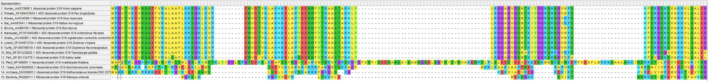
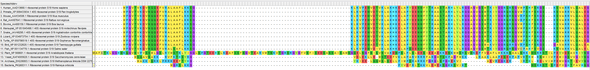
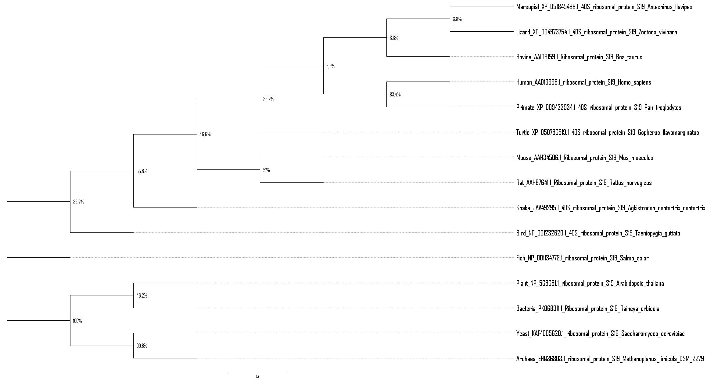
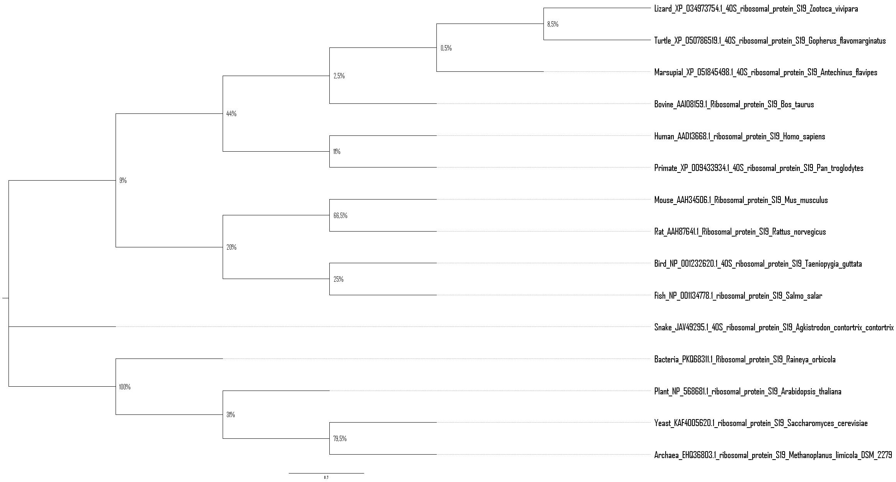
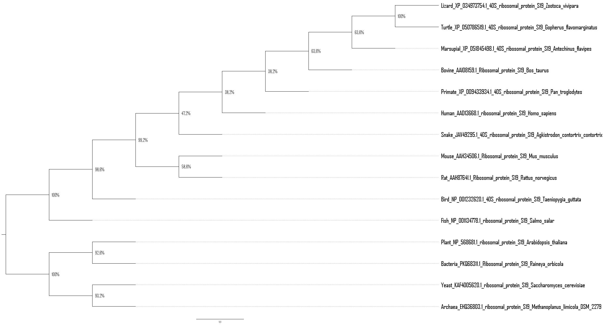
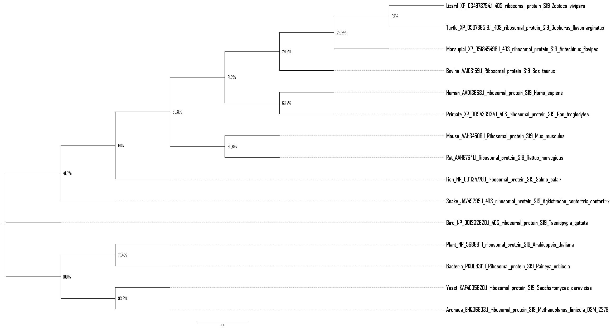
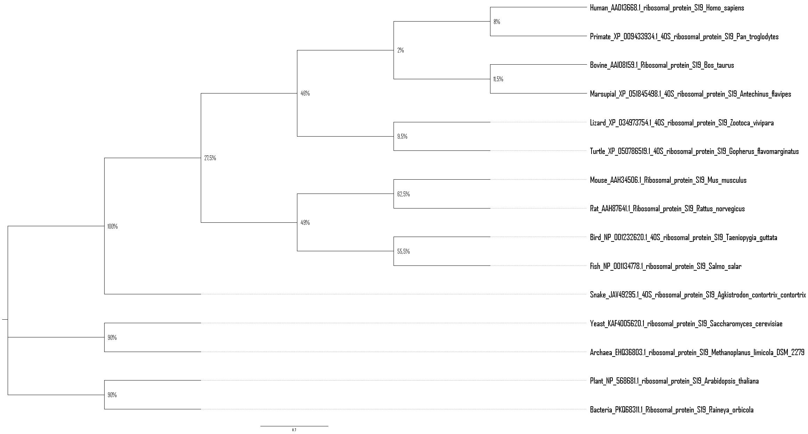

# Протеин: Ribosomal Protein S19  

## Исходные данные
1\. `fasta` файл с аминокислотными последовательностями генов находится в `./files/sequences.fasta`  

## Выравнивания
2\. Выравнивание через ClustalW и Muscle.  

Есть ли разница в выравниваниях? Да, есть.  

## Филогенетические деревья
3\. Для алгоритма Maximum Likelihood использовалось bootstrap-значение = 200 (для более быстрого выполнения).    
Для остальных алгоритмов использовалось bootstrap-значение = 500.  
Для получения детальных картинок деревьев использовалась программа `FigTree` (построенные деревья экспортировались из `MEGA`, использовался `Newick` формат).  
В `./pics` дополнительно представлены `bootstrap consensus tree` после постройки филогенетического дерева.

ClustalW.  
UPGMA:

NJ:

ML:

Muscle.  
UPGMA:

NJ:

ML:

## Выводы
Q: Какой алгоритм выравнивания лучше сработал - `ClustalW` или `Muscle`?  
A: В общем, чуть лучшие выравнивания получил алгоритм `Muscle` (взять, например, `ClustalW/Neighbor-Joining` и `Muscle/Neighbor-Joining`, в последнем bootstrap-значения получились, в среднем, выше).

Q: Одинаковая ли получилась топология деревьев при построении разными методами?  
A: Топологии деревьев различаются. Например, в `ClustalW/UPGMA` Lizard и Turtle расположены ближе, чем в `ClustalW/Neighbor-Joining`

Q: Одинаковые ли получились бутстрэп-значения?  
A: bootstrap-значения получились разные.

Q: Совпадают ли деревья, построенные по одному гену с принятыми деревьями видов?  
A: Нет, не совпадают. Например, в `ClustalW/Neighbor-Joining` Zooteca Vivipara (Живородящая ящерица, пресмыкающиеся) расположена ближе к Antechinus flavipes (Желтоногая сумчатая мышь, млекопитающие), чем к Gopherus flavomarginatus (Мексиканский гофер, пресмыкающиеся).