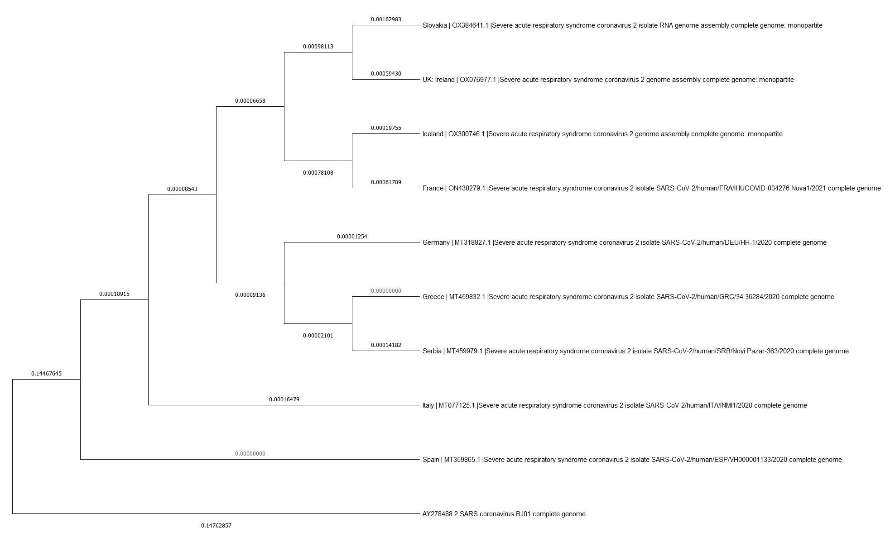
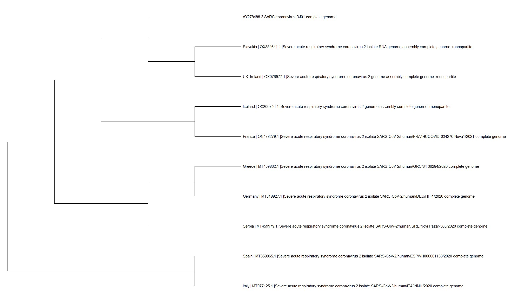
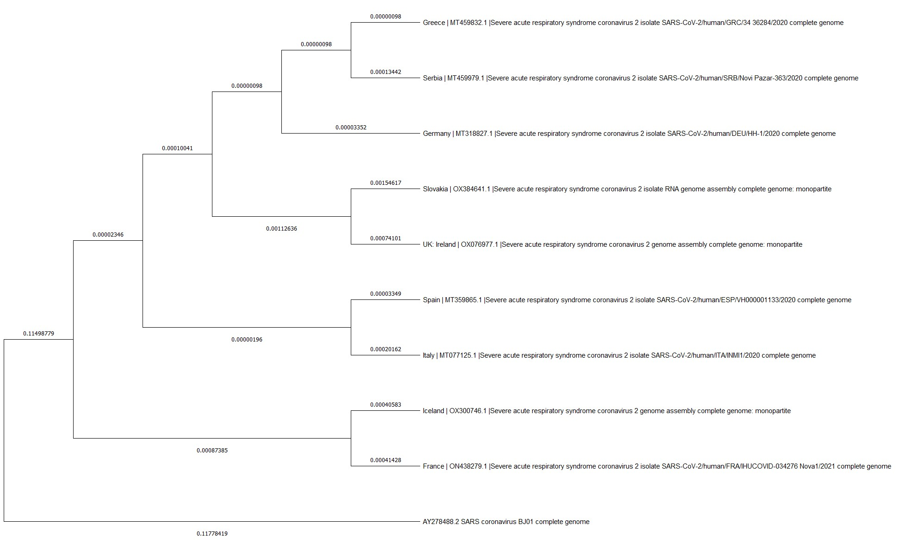
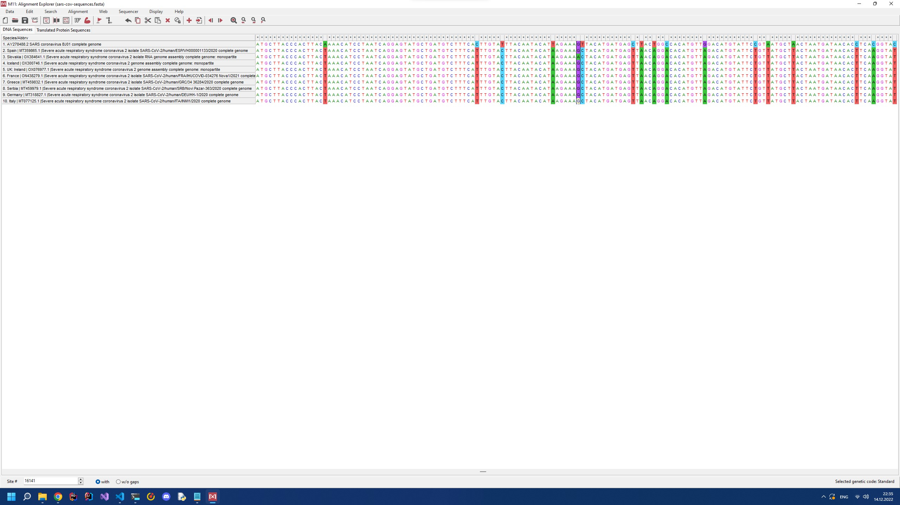
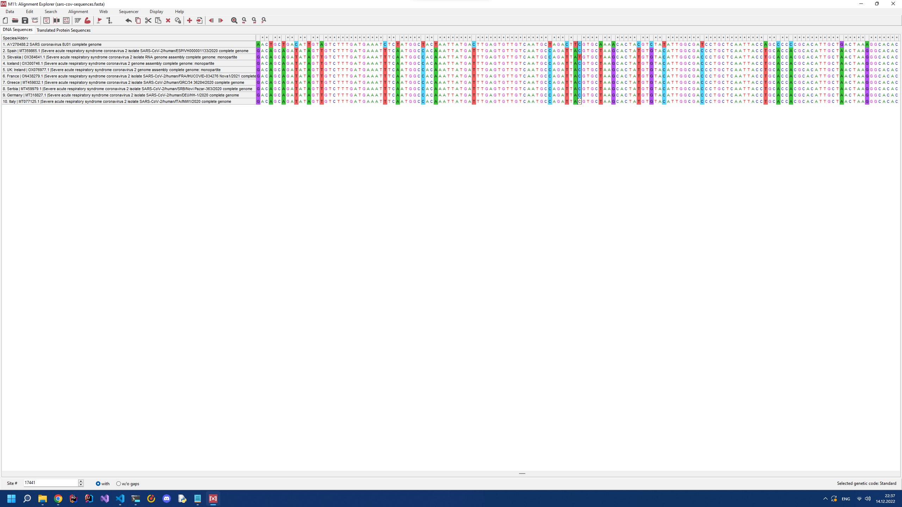
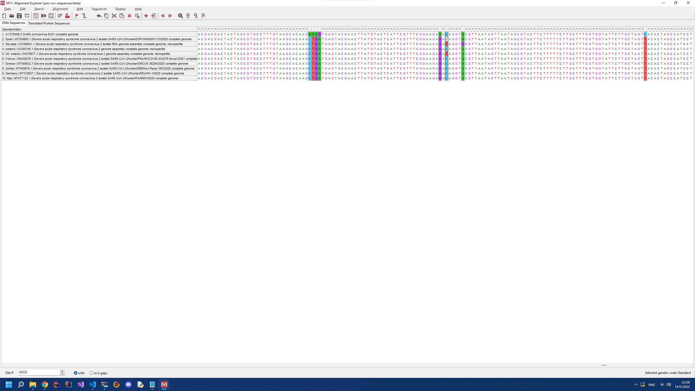
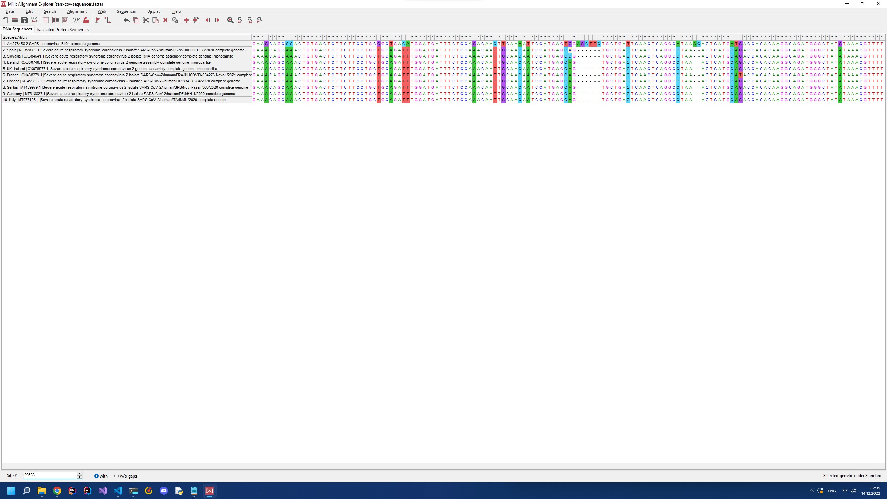
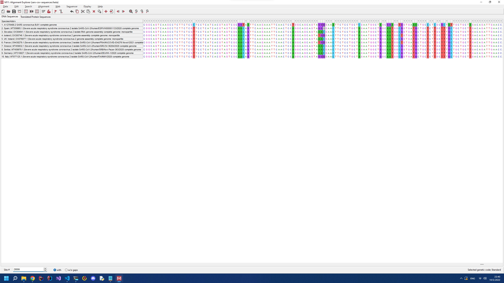

# Анализ мутаций коронавируса из людей разных стран

## Выравнивание, деревья и анализ заражения

Возьмем геномы `SARS-CoV-2` из стран:
1. Словакия 
2. Исландия
3. Соединенное Королевство: Ирландия
4. Франция
5. Греция (Афины)
6. Сербия (Нови-Пазар)
7. Германия
8. Испания
9. Италия

К `fasta`-файлу с геномами добавим геном `SARS-Cov-1` (штамм `BJ01`, https://www.ncbi.nlm.nih.gov/nuccore/AY278488).  
(см. `files/sars-cov-sequences.fasta`)  

Произведем выравнивание последовательностей, используя алгоритм `Muscle` в программе `Mega`.  
(см. `files/sars-cov-sequences-alignment.meg`)  

Построим филогенетические деревья для выравненных поседовательностей, используя алгоритмы (будем экспортировать дерефься в формат `Newick`):
1. Метод расстояний (Neighbor-Joining) (см. `files/sars-cov-tree-nj.nwk` и `pics/sars-cov-tree-nj.jpg`) 

2. Maximum Parsimony (см. `files/sars-cov-tree-mp.nwk` и `pics/sars-cov-tree-mp.jpg`)

3. Maximum Likelihood (см. `files/sars-cov-tree-ml.nwk` и `pics/sars-cov-tree-ml.jpg`)

В Neighbor-Joining и Maximum Likelihood будем отображать branch lengths (длины ветвей).  
Будем искать самых близкий геном к `SARS-Cov-1`, используя суммы branch lengths (будем использовать Maximum Likelihood).  
Чем меньшу сумма branch length, тем меньше произошло эволюционных изменений, тем раньше была заражена эта страна.
Страна    Сумма branch length  
Spain:    0.1150467  
Greece:   0.1151146  
Germany:  0.11514616  
Italy:    0.11521483  
Serbia:   0.11524804  
Iceland:  0.11626747  
France:   0.11627592  
Ireland:  0.11697903  
Slovakia: 0.11778419  

## Анализ мутаций
Из полученных результатов видно, что Испания была заражена раньше всех, а Словакия позже всех.  
Самый первый по дереву геном после `SARS-Cov-1` - это геном из Испании (по сумме branch length).
Самый последний по дереву геном - это геном из Словакии.
Мутации:
- site: 16141 | Spain: G | Slovakia: A | Попадает в ген: `ORF1ab`

- site: 17441 | Spain: C | Slovakia: T | Попадает в ген: `ORF1ab`

- site: 26333 | Spain: C | Slovakia: T | Попадает в ген: `E`

- site: 29633 | Spain: A | Slovakia: C | Попадает в ген: `ORF10`
  

- site: 29006 | Spain: G | Slovakia: C | Попадает в ген: `N`

(см. `pics/sars-cov-alignment-<site>.meg`)