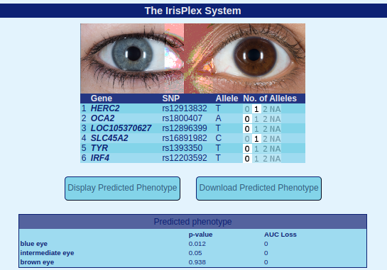
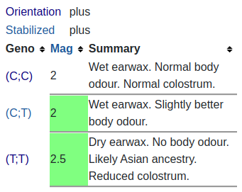
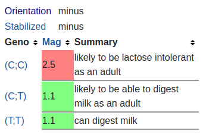
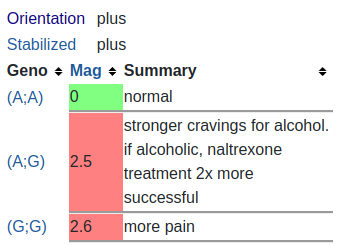
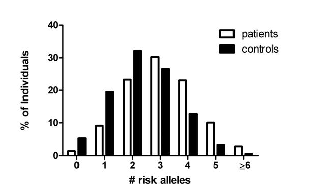

# Анализ генотипа

Будем использовать генотип пользователя *alanlamsiu* с сайта opensnp: https://opensnp.org/data/11437.23andme.9354  
(см. `./files/genotype`)

## 1: Определение цвета глаз
Какой наиболее вероятный цвет глаз у этого человека?  

Для определения цвета глаз будем использовать систему `IrisPlex` с сайта: https://hirisplex.erasmusmc.nl/.  
Нужно проанализировать 6 генов и их снипы. Для каждого снипа получим генотип человека и посчитаем число определенных аллелей.  
Будем помнить о правиле комплиментарности: `A = T, C = G`. (данные получены через ctrl+f по таблице)  
|        Ген    |    Снип    | Аллель | Генотип | Число аллелей |
|---------------|------------|--------|---------|---------------|
|      HERC2    | rs12913832 |    T   |    AG   |       1       |
|    	OCA2    | rs1800407  |    A   |    CC   |       0       |
|  LOC105370627 | rs12896399 |    T   |    GG   |       0       |
|  	 SLC45A2    | rs16891982 |    C   |    CG   |       1       | 
|       TYR     | rs1393350  |    T   |    GG   |       0       |
|      IRF4     | rs12203592 |    T   |    CC   |       0       |

Вводим число аллелей в систему.  
  
На этом сайте p-value на самом деле означает вероятность.  
Получаем, что вероятнее всего у данного человека карие глаза.

## 2: Снипы и признаки
Из snpedia выбрать три разных интересных снипа и проверить на предрасположенность/связи с тем или иным признаком.  
Возьмем три снипа: rs17822931 (определяет вид ушной серы, пота и запаха тела), rs4988235 (дает непереносимость лактозы), rs1799971 (усиливает тягу к алкоголю).  

|     Снип    |    Генотип    |                   Связь с признаком у данного человека                            |
|-------------|---------------|-----------------------------------------------------------------------------------|
| rs17822931  |       CT      | Влажная ушная сера, чуть более приятный запах тела                                |
|  rs4988235  |       AG      | Вероятнее всего можно будет переваривать молоко будучи взрослым                   |
|  rs1799971  |       AG      | Усиленная тяга к алкоголю; при алкоголизме лечение налтрексоном в 2 раза успешнее |

Замечание.  
23andme (компания, которая провела генотипирование данного человека) приводит все данные в соответствии с положительным стрендом GRCh37.  
При этом снип `rs4988235` на SNPedia указан на отрицательном стренде (Orientation и Stabilized Orientation - minus).
Тогда генотип человека будет отличаться от генотипов, указанных на SNPedia.  
Чтобы это исправить, нужно применить правило комплементарности, "перевернув" аллели. 
Для генотипа `AG` получим `TC` (или `CT`, это неважно). Тогда уже можно будет соотнести новый генотип с тем, что указан в SNPedia.  

## 3: Дополнительное задание. Риск тромбоза
Повышен или понижен риск тромбоза у данного человека? На основе модели из 5 снипов: rs6025 (F5, factor V Leiden), rs1799963 (F2, 20210 G > A), rs8176719 (ABO), rs2066865 (FGG, 10034 C > T), and rs2036914 (F11).  

Определять риск будем на основании статьи: https://ashpublications.org/blood/article/120/3/656/30474/Multiple-SNP-testing-improves-risk-prediction-of.
Найдем генотипы для каждого снипа и посчитаем число риск аллелей. 
|     Снип    |   Генотип    |   Риск аллель      |  
|-------------|--------------|--------------------|
|    rs6025   |      CC      |          T (или A) |
|  rs1799963  |      GG      |          A         | 
|  rs8176719  |      DD      |          G         |
|  rs2066865  |      AG      |          T (или A) |
|  rs2036914  |      CT      |          С         |

Замечания: 
- Снип rs2066865 имеет риск аллель, т. к. данный снип на SNPedia на отрицательном стренде -> правило комплиментарности,
- Снип rs1799963 в 23andme - i3002432
- DD - deletion & deletion

Итого, получаем, что всего для данного человека 2 риск аллели (в снипах `rs2066865` и `rs2036914`).   
  
Тогда риск: ~23-33% (средний риск, слегка понижен).

