# Анализ раковых генов

## Часть 1. Выбрать индивидуальный раковый ген для анализа
 
Скачаем все раковые драйверы с веб-сайта http://ncg.kcl.ac.uk/download.php и выберем оттуда любой ген (`./files/cancer-drivers.tsv`).  
Был выбран ген `FAM135B`.  

## IntrOGen: Мутации
1\. Найдите выбранный ген в базе данных IntOGen.   
В каких типах рака он мутировал?   
Какие типы мутаций – точечные или структурные (вставки, делеции, транслокации)?   
Включите скриншот с графическим поиском в отчет.  

Найдем ген `FAM135B` в базе данных IntrOGen.  
Ген `FAM135B` мутирует в следующих 5 видах рака:
- Head and neck squamous cell carcinoma - плоскоклеточная карцинома головы и шеи.
- Esophageal cancer - рак пищевода.
- Lung squamous cell carcinoma - плоскоклеточная карцинома легких.
- Pancreas adenocarcinoma - аденокарцинома поджелудочной железы.
- Uterine carcinosarcoma - карциносаркома матки.

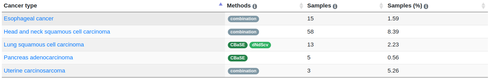

В основном наблюдаются точечные `missense` мутации - 69%, за ними идут 25% точечных `synonymous` мутаций, 5% точечных `protein-truncating` мутаций и 1% структурных `splice-site` мутаций.  
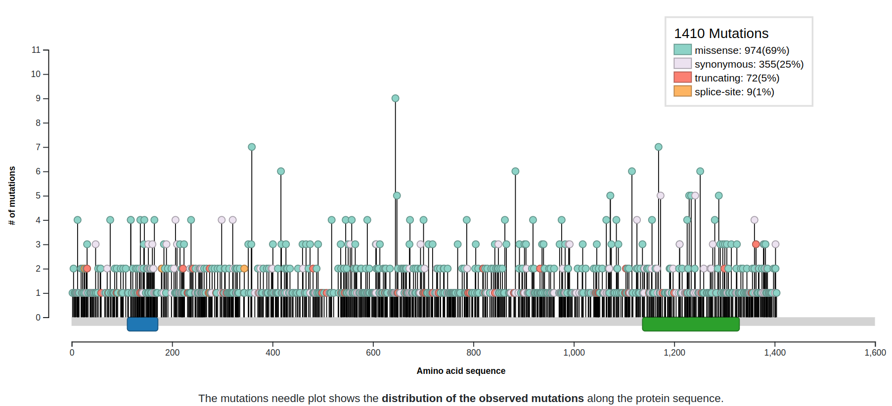

1\. Мутации для плоскоклеточной карциномы головы и шеи:
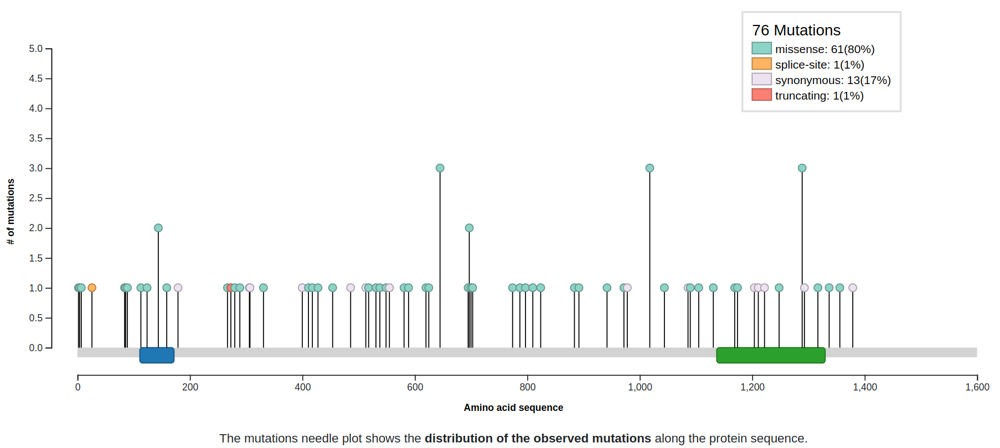

2\. Мутации для рака пищевода:
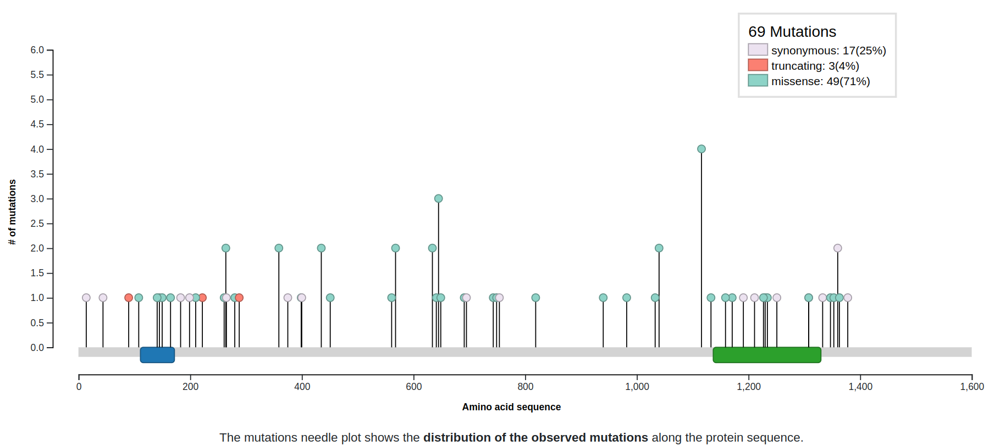

3\. Мутации для плоскоклеточной карциномы легких:
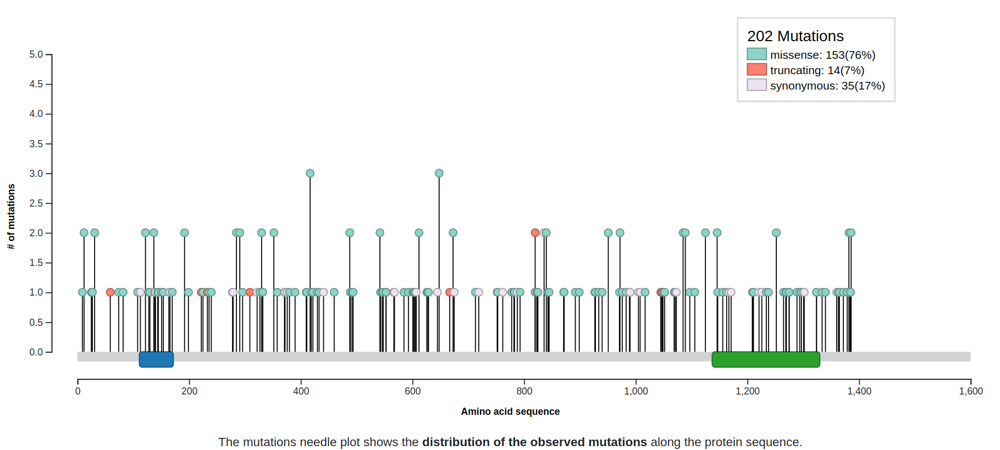

4\. Мутации для аденокарциномы поджелудочной железы:
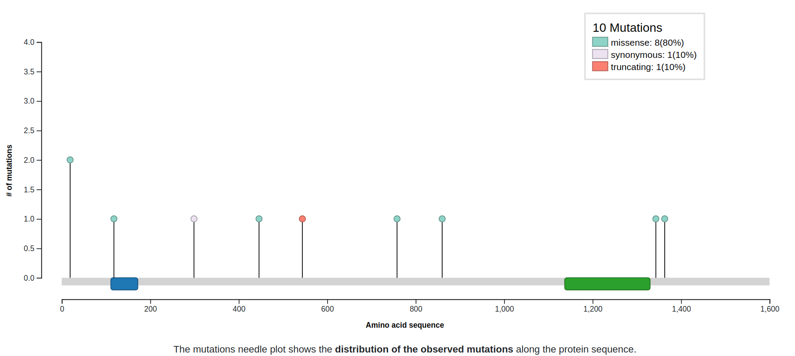

5\. Мутации для карциносаркомы матки:
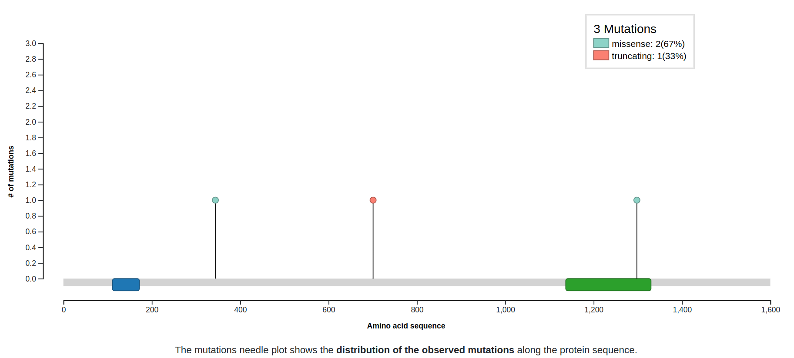

## ICGC: Мутации
2\. Произведите поиск выбранного гена на портале ICGC (https://dcc.icgc.org/).  
В каких типах рака выбранный ген мутирует?  
Включите скриншот с графическим поиском в отчет.  

Найдем ген `FAM135B` на портале ICGC (*предварительно включив vpn français* ☕🥖🏳️).  
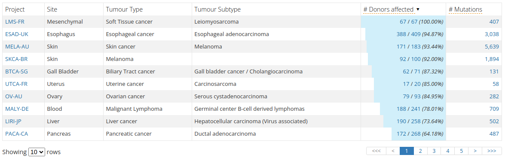

## Часть 2. Выбрать индивидуальный геном для анализа

C портала ICGC (https://dcc.icgc.org/) скачать индивидуальный геном с мутациями.  
Идете в Data Repository (зеленый кружочек с облаком и стрелочкой). Выбираете SSM (single somatic mutations).  
Выбираете образец. Скачиваете файл, содержащий только координаты одноточечных мутаций.  
Проверяете, есть ли мутации в гене, который Вы выбрали. Показываете скриншот анализа.  
Также проверяете еще 4 (всего 5 с изначальным) генов на наличие мутаций. Пишите, почему решили проверить еще эти 4 гена.  
Включите скриншоты с поиском в отчет и развернутые ответы.  

Возьмем координаты одноточечных мутаций донора `DO26444` из проекта исследований `LUSC-US` (`./files/donor-ssm.tsv`), в котором встречались мутации `FAM135B`.  
У донора имеется 10 мутаций в гене `FAM135B` (проще всего использовать ctrl+f по файлу, ищем по `ENSG00000147724` - id для `FAM135B` в Ensemble):
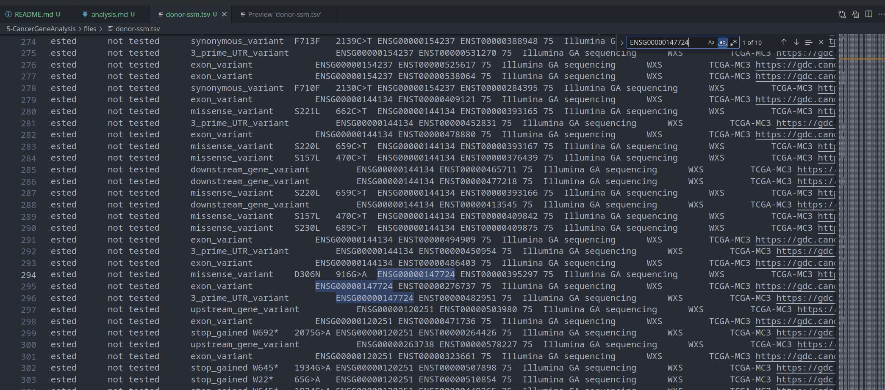

`LUSC-US` рассматривало рак легких - плоскоклеточную карциному, поэтому часть доноров этого исследования имеет мутации, связанные с повышенным риском данного рака. Следовательно, проверим еще 4 гена, мутации которых связаны с плоскоклеточной карциномой легких.  
Для этого вернемся зайдем на веб-сайт http://ncg.kcl.ac.uk/cancertypedrivers.php с видами рака и найдем там "Lung squamous cell carcinoma".
Имеем 17 канонических драйверов для данного вида рака:

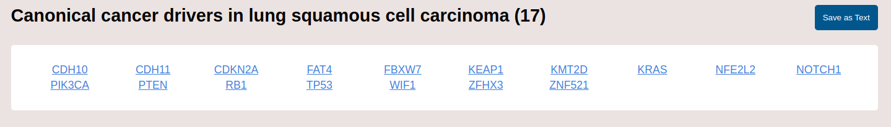

Проверим наличие мутаций в этих четырех генах в доноре `DO26444` (аналогичным поиском по файлу через их id в Ensemble):  

`CDH10` - 'ENSG00000040731' - 10 мутаций:  
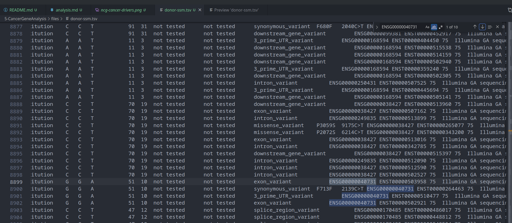

`CDH11` - `ENSG00000140937` - 3 мутации:
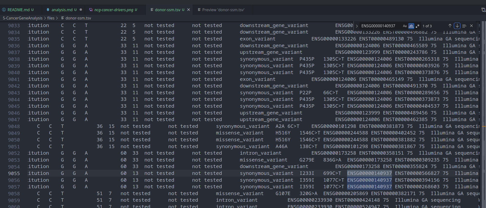

`CDKN2A` - `ENSG00000147889` - 15 мутаций:
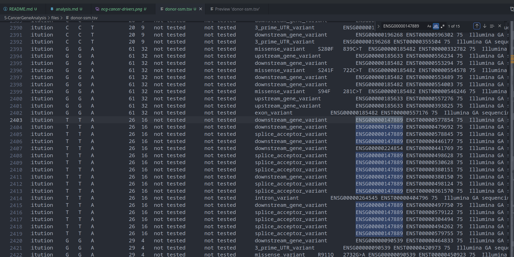

`FBXW7` - `ENSG00000109670` - 7 мутаций:
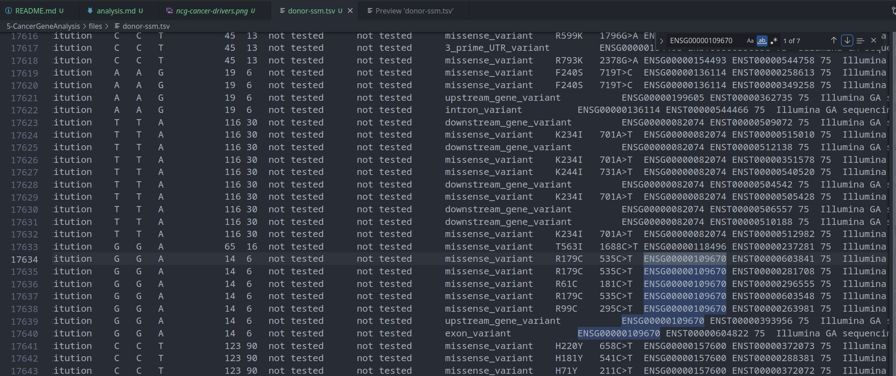
