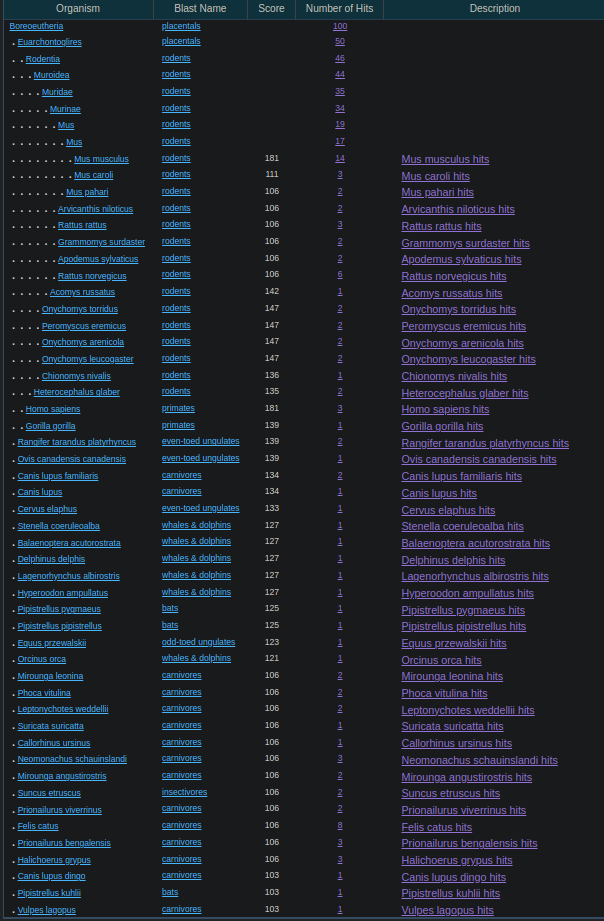

# Сравнительная геномика

## Часть 1. Сравнение генов человека и обезьяны
Существует множество способов для оценки сходства организмов и их геномов. Давайте оценим сходство человека и обезьяны, взяв несколько последовательностей из генома человека, найдем гомологичные им последовательности в геноме шимпанзе.

### Задание 1 (1 балл). Оценить сходство геномов найдя среднее сходство для 10 белков.

Инструкция:
1. Выберите 10 белков человека (bp uniprot) и внесите их в таблицу. 
2. Найдите их ортологи у шимпанзе по мнемонике Uniprot или базе ортологов.
3. Постройте парное выравнивание
4. Найдите среднее identity и similarity.

Было выбрано 10 белков человека, их ортологи у шимпанзе были найдены по мнемонике Uniprot. 
Скачанные аминокислотные последовательности находятся в `fasta`-файлах в `./files/proteins/`.
|    Белок    | Ортолог у шимпанзе |
|-------------|--------------------|
|`HIP1_HUMAN` | `A0A2I3T2B1_PANTR` |
|`NFIB_HUMAN` | `A0A2I3T6E9_PANTR` |
|`IRS4_HUMAN` | `A0A2I3SS11_PANTR` |
|`GBRP_HUMAN` | `A0A2J8LXV6_PANTR` |
|`MYO1C_HUMAN`| `A0A2I3TLG6_PANTR` |
|`MEI4_HUMAN` | `A0A2I3TQW9_PANTR` |
|`IFM5_HUMAN` | `H2R5P5_PANTR`     |
|`EME2_HUMAN` | `H2RHN9_PANTR`     |
|`ELOV7_HUMAN`| `A0A2J8KKV3_PANTR` |
|`ITAV_HUMAN` | `H2R6C3_PANTR`     |

Построим парное выравнивание для каждой пары белков. Для этого будем использовать веб-сайт https://www.ebi.ac.uk/Tools/psa/emboss_needle/.  
Все парные выравнивания можно найти в `./files/alignments/`.
| Белки | Identity | Similarity |
|-------|----------|------------|
|`HIP1` | 94.8%    | 95.1%      |
|`NFIB` | 66.0%    | 66.2%      |
|`IRS4` | 99.4%    | 99.6%      |
|`GBRP` | 99.8%    | 100.0%     |
|`MYO1C`| 99.3%    | 99.9%      |
|`MEI4` | 99.0%    | 99.7%      |
|`IFM5` | 99.2%    | 99.2%      |
|`EME2` | 98.4%    | 98.9%      |
|`ELOV7`| 99.3%    | 99.6%      |
|`ITAV` | 99.8%    | 99.9%      |

Среднее Identity:   95.5%  
Среднее Similarity: 95.81%

### Здание 2* (1 балл). Оценить сходство геномов найдя среднее сходство для 100 нуклеотидных последовательностей длины 100 выбранных из генома случайно.
Инструкция:  
Нужно написать небольшой скрипт, который:  
1. Извлекает из генома человека 100 случайных последовательностей
2. Собирает их в fasta файлa  

см. `./human-genome-blast.ipynb` и `./files/human-genome-blast-output.fasta`

Далее:  
1. Получившийся файл подаем на вход blast. Поиск ограничиваем геномом шимпанзе.
2. Скачиваем результат в виде таблицы (см. `./files/blast-result.csv`)
3. Из нее извлекаем необходимые значения и находим среднее identity.

Среднее identity по всем hsp (High-Scoring Segment Pairs) по всем выравниваниям: 84.269%

## Часть 2. Древняя ДНК.
В этом задании мы познакомимся с трудностями, которые могут сопровождать анализ древней ДНК. Загрязнением (контаминацией) и фрагментацией ДНК.  
### Задание 1. Выявление источника загрязнения.
При работе с ДНК образец может произойти загрязнение образца. Определение источника загрязнения поможет выявить источник проблемы и избегать его в будущем. В этом задании вам нужно определить источник(-и) загрязнения.  

Вопрос 0. На ПЦР отправили загрязненный образец состоящий из 2х молекул ДНК исследуемого организма и 3х молекул ДНК загрязнения. Считая, что после каждого цикла число молекул удваивается. Определите, сколько % молекул будет принадлежать исследуемому организму после  
1. (0,25 балла) десяти циклов ПЦР
2. (0,25 балла) сорока циклов ПЦР

1\. 10 циклов. 2/5 = 0.4 - постоянное отношение молекул ДНК исследуемого организма к молекулам ДНК загрязнения. 0.4^10 ~ 0.0001049 ~ 0.01049% молекул будет принадлежать исследуемому организму после 10 циклов ПЦР.  
2\. 40 циклов. По аналогии, 0.4^40 ~ 1.209e-16 = 1.209e-14% молекул будет принадлежать исследуемому организму после 40 циклов ПЦР.

Вопрос 1. (1 балл). Пусть у Иванова есть собака, а у Петрова кошка. Определите виновника(-ов) загрязнения, считая, что ДНК этих животных могла попасть в образец только через хозяев. Ответ обоснуйте. 
Инструкция: 
Скачайте файл с чтениями с диска. Номер варианта указан в таблице. С помощью BLAST (в настройках указывать somewhat similar sequences) определите к какому виду принадлежат чтения. Видом для чтения считать вид лучшей находки, преодолевшей выбранный вами порог по identity и e-value.  
Есть ли среди них кошка (`Felis catus`) или собака (`Canis lupus familiaris` или `Canis familiaris`)?

Чтения представлены в `./files/67.fasta`.
Результат `blast` представлен в `./files/67-blast.txt`.  

`Felis catus` обнаруживается только в `read74` и `read87`. Лучшие выравнивания для этих ридов находятся у `Mus musculus` (домовая мышь) с `e-value` и `identity` `2e-41` и `100%` для обоих ридов соответственно. При этом в `e-value` для `Felis catus` равен `4e-17` и `1e-18` для всех выравниваний для ридов соответственно.  
`Canis lupus` обнаруживается в `read4`, `read5`, `read6`, `read7`, `read10` и т. д. `e-value` и `identity` для выравниваний составляет `2e-41` и `100%` соответственно.  
`e-value` - ожидаемое число `hit`ов, которые можно случайно найти в этой же базе, с таким же `score`ом или больше. Чем ниже `e-value` для `hit`а, тем более он значим. На основе данного `blast`а можно заключить, что ДНК собаки Иванова загрязнила исследуемое ДНК.

Вопрос 2. (2 балла). Определите, к геному какого организма относится каждое чтение и найдите долю для каждого представленного вида.  
О каких источниках загрязнения свидетельствует видовой состав?

Чтобы определить к какому геному относится каждое чтение, достаточно перейти во вкладку `Alignments` и скачать результаты в виде `FASTA (Aligned Sequences)` (см. `./files/67-seqdump.fasta`). В описании каждого рида будет находится лучший для него `hit` с названием данного вида.  
Чтобы определить долю для каждого вида, достаточно перейти во вкладку `Taxonomy` и выбрать `Lineage`. Доля каждого вида будет находится в колонке `Number of Hits`.  

На основании данных картинки можно заявить, что источником загрязнения является экзогенная ДНК, в частности, ДНК человека (Иванова) и ДНК собаки (собаки Иванова). Экзогенная ДНК относится к ДНК, поступающей извне анализируемого образца, чем (скорее всего) и являются ДНК человека и ДНК собаки.  

На 9-10. (1 балл). Подсчитайте (скриптом) какие виды встречаются чаще всего, среди топ 10 результатов BLAST. В отчете должен быть код и результаты.  
см. `./67-top10-blast-taxa.ipynb`.

### Задание 2. Фрагментация ДНК.
После смерти организма система репарации ДНК перестает работать и со временем ДНК все сильнее и сильнее фрагментируется. В данном задании мы оценим (очень грубо) длину фрагмента ДНК меньше которой его принадлежность невозможно точно распознать.  
Инструкция:
1. Выберем участок генома человека длиной 100.  
2. Будем отрезать от него по нуклеотиду, а получившиеся последовательности запишем в fasta файл.  
3. Получим fasta файл типа:  
   
   >fragment_100  
    ACTG….ACTG  
    >fragment_99  
    ACTG….ACT  
    …  
    >fragment_2  
    AC  
    >fragment_1  
    A  

Вопросы:  
1. (1 балл)	При какой длине фрагмента E-value становиться больше 0,05?  
2. (1 балл)	Меняется ли это значение если при запуске BLAST ограничить поиск человеком? Почему? (подсказка: вспомните определение)

Был выбран случайный участок генома с помощью `./human-genome-blast.ipynb` (см. `./files/fragment-dna.fasta`).  
